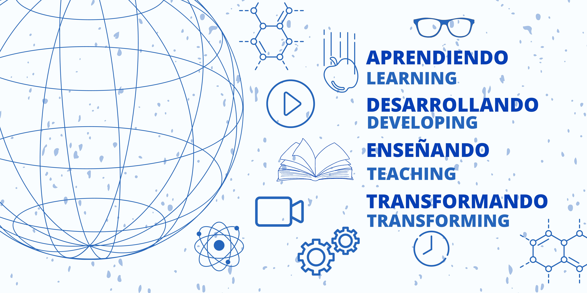

# 👋 Hi there, I'm @SAGS-pyc
- 🧒 Santiago Alexander Galindo Salinas 
- Salinas. G. S.
  

## 🚀 About Me
- 👀 I’m deeply interested in Physics, Astronomy, and Data Science, particularly in how we can use programming to explore and solve complex scientific problems.
- 🌱 I’m currently learning Python to enhance my skills in data analysis and scientific computing, focusing on applications in physics and astronomy.
- 💞️ I’m looking to collaborate on open-source projects related to astrophysics, data science, big data and educational tools that make complex concepts more accessible.
- 📚 I’m also diving into topics like linear algebra, calculus, and their applications in machine learning and AI research.
- 😄 Pronouns: He/Him

## 💼 Professional Interests
- I'm exploring opportunities in **Scientific Computing** and **Data Analysis**, **Data Science**, with a strong emphasis on **Python** for data-driven physics and astronomy projects or math projects .
- Looking forward to contributing to projects that combine **Education**, **Science**, and **Technology**.

## 📫 How to reach me
- Email: [sagsalinas365@gmail.com](mailto:sagsalinas365@gmail.com)
- LinkedIn: [www.linkedin.com/in/s-a-g-s](www.linkedin.com/in/s-a-g-s)
- Portfolio: [My Portfolio Website](in process)

## ⚡ Fun Fact
- Besides coding, I'm bachelor degree in Physics and I'm an pasionate for the stars and enjoy sharing the wonders of the universe with others. 👨‍🏫🌌

<!---
SAGS-pyc/SAGS-pyc is a ✨ special ✨ repository because its `README.md` (this file) appears on your GitHub profile.
You can click the Preview link to take a look at your changes.
--->
